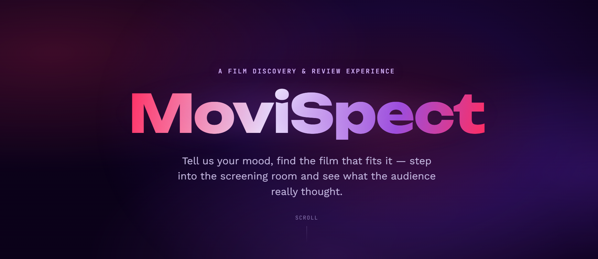
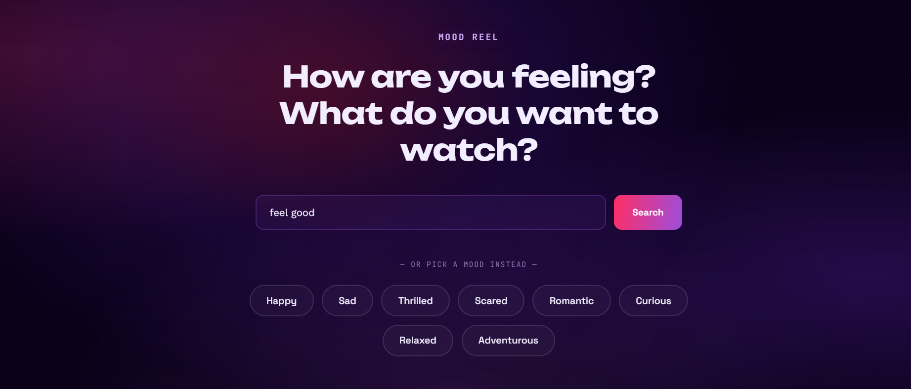
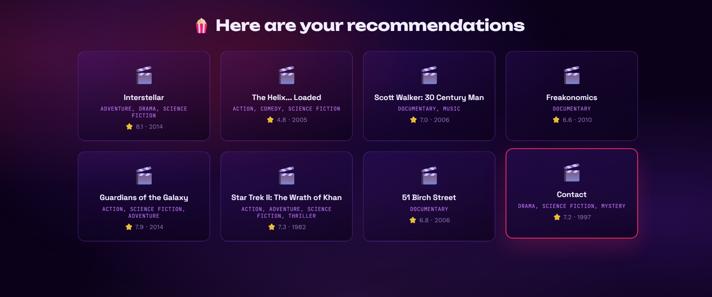
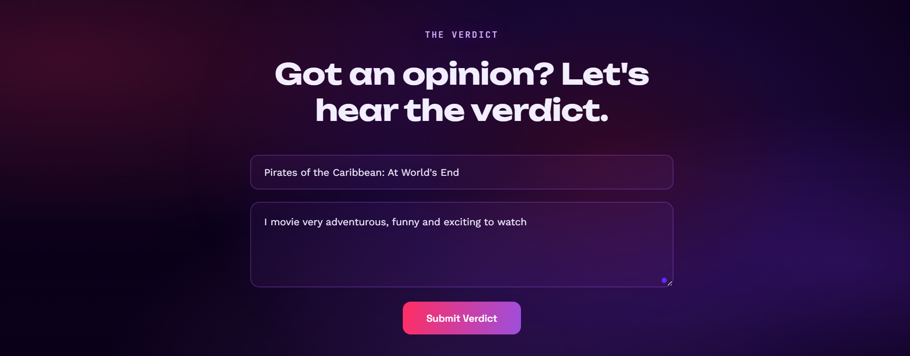

# 🎬 MoviSpect (CineSense)

A movie discovery and review-sentiment web app — combining a mood-based recommendation engine with a real machine learning sentiment classifier trained on IMDB reviews.

**Live demo:** https://cine-sense-1-i0rb.onrender.com
**API:** https://cine-sense-tgnu.onrender.com







> Note: both services run on Render's free tier and may take 30–60 seconds to wake up after a period of inactivity. This is expected behavior, not a bug.

---

## What it does

### 🎭 Mood Reel
Tell the app how you're feeling — happy, thrilled, romantic, curious, and more — and it recommends real movies that match, using content-based filtering (TF-IDF + cosine similarity) over a dataset of ~4,800 films from TMDB. You can also describe what you're in the mood for in free text.

### 📝 The Verdict
Write a review for any movie. A logistic regression model — trained on 50,000 IMDB reviews using TF-IDF features — classifies it as positive or negative in real time, then adds it to that movie's running tally of community sentiment.

---

## Tech stack

| Layer | Tools |
|---|---|
| Frontend | HTML, CSS, vanilla JavaScript |
| Backend | FastAPI (Python) |
| ML | scikit-learn (TF-IDF + Logistic Regression), pandas |
| Data | TMDB 5,000 Movie Dataset, IMDB 50K Review Dataset |
| Storage | SQLite (review tallies) |
| External API | TMDB (posters, streaming availability) |
| Hosting | Render (Web Service + Static Site) |

---

## Project structure

```
.
├── index.html              # Frontend — all UI, animation, and API calls
├── main.py                  # FastAPI backend — all /api/* routes
├── preprocess.py            # Text cleaning for the sentiment model
├── train.py                 # Trains the sentiment model from the IMDB dataset
├── recommender.py           # Mood-based recommendation engine
├── database.py              # SQLite storage for review tallies
├── tmdb_client.py           # TMDB API wrapper (posters, watch providers)
├── data/
│   └── movies_clean.csv     # Cleaned TMDB movie metadata
├── models/
│   ├── model.pkl            # Trained logistic regression sentiment model
│   └── tfidf.pkl            # Fitted TF-IDF vectorizer
└── requirements.txt
```

---

## Running it locally

```bash
pip install -r requirements.txt
uvicorn main:app --reload --port 8000
```

Then open `index.html` directly in a browser. By default it points at the deployed Render API — change the `API_BASE` constant near the top of the `<script>` block in `index.html` to `http://127.0.0.1:8000` to use your local backend instead.

You'll also need a free TMDB API key in a `.env` file:
```
TMDB_API_KEY=your_key_here
```

---

## Known limitations

- **Sentiment model uses TF-IDF + Logistic Regression**, which has no concept of word order. This means negation can sometimes be misread — e.g. "I did **not** like the movie" can occasionally be classified as positive, because the model sees "like" as a strong positive signal without understanding it's been negated. This is a well-documented limitation of bag-of-words models in general, not a bug specific to this implementation. A future improvement would involve n-gram features or a transformer-based model.
- **Review data is not permanently persistent** on the free hosting tier — the SQLite database resets on each backend redeploy.
- **Mood-to-genre mapping is a manual, editorial choice**, not learned from data — this keeps the recommendation logic transparent and explainable.

---

## Author

Built by Ancy Chandra as a personal learning project exploring sentiment analysis, content-based recommendation, and full-stack deployment.

